# DermaVision

> Plateforme web intelligente d'aide au diagnostic dermatologique basée sur l'intelligence artificielle pour la classification des lésions cutanées (bénin ou malin).

**Dépôt GitHub :** https://github.com/lobnakhalfallah1-droid/SKIN_CANCER_APP

---

## Aperçu de l'interface

| Tableau de bord | Connexion | Résultat IA |
|:---:|:---:|:---:|
| 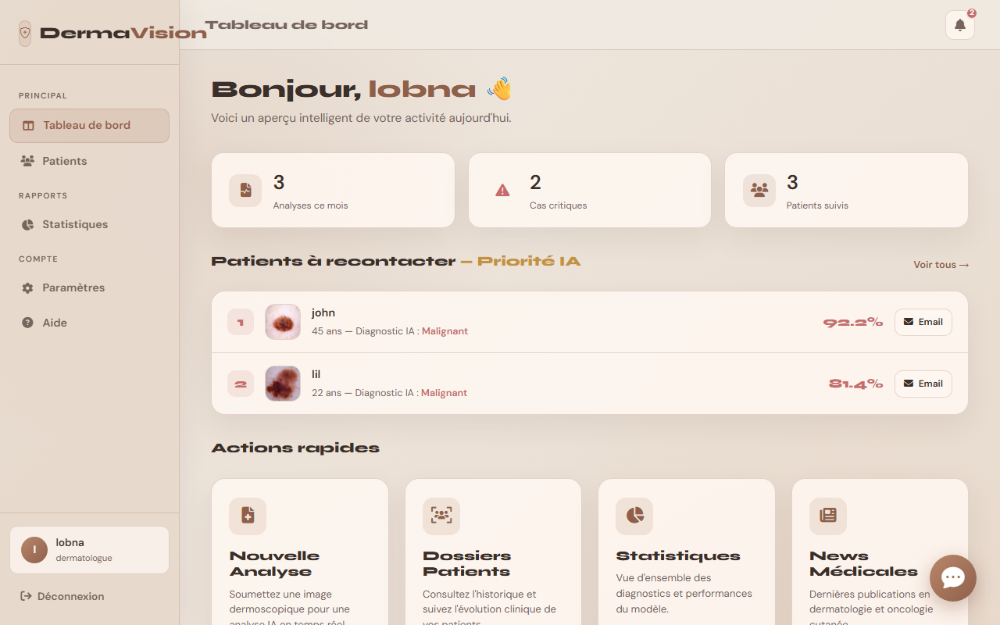 | 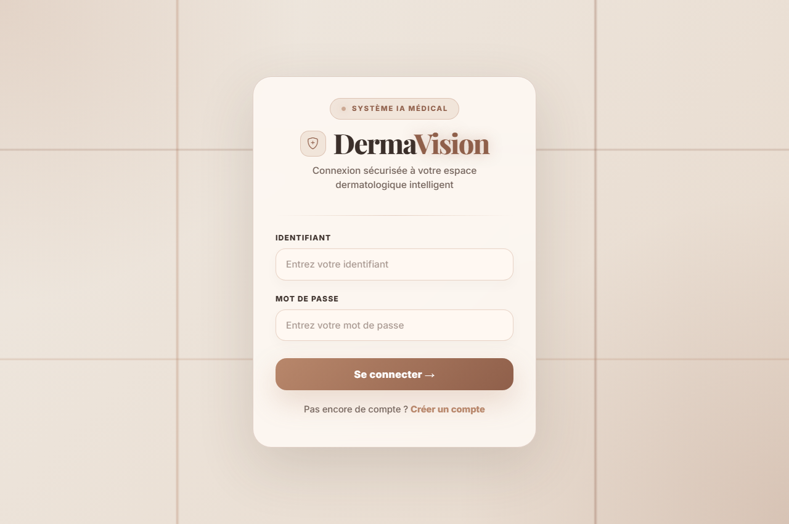 | 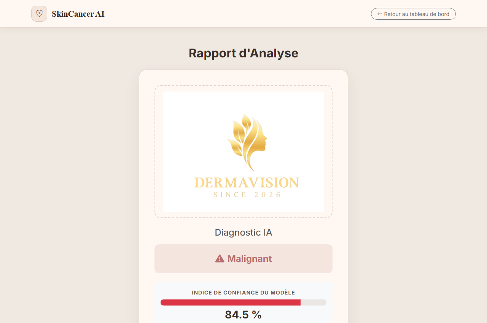 |

---

## Table des matières

- [Aperçu du projet](#aperçu-du-projet)
- [Fonctionnalités](#fonctionnalités)
- [Pipeline IA](#pipeline-ia)
- [Technologies utilisées](#technologies-utilisées)
- [Structure du projet](#structure-du-projet)
- [Installation](#installation)
- [Configuration de la base de données](#configuration-de-la-base-de-données)
- [Lancement de l'application](#lancement-de-lapplication)
- [Utilisation](#utilisation)
- [Captures d'écran](#captures-décran)
- [Points forts](#points-forts)
- [Améliorations futures](#améliorations-futures)
- [Avertissement médical](#avertissement-médical)
- [Auteurs](#auteurs)
- [Licence](#licence)

---

## Aperçu du projet

DermaVision est une application web médicale intelligente permettant l'analyse de lésions cutanées à partir d'images dermoscopiques.

Elle combine une interface web moderne et un modèle de deep learning pour fournir un **diagnostic préliminaire (bénin ou malin)** accompagné d'un score de confiance.

L'utilisateur peut :

- Téléverser une image dermatologique
- Obtenir une prédiction IA avec score de confiance
- Consulter un rapport d'analyse détaillé
- Gérer l'historique complet des analyses patients
- Interagir avec un assistant IA médical conversationnel
- Recevoir des notifications par email pour les cas à risque

---

## Fonctionnalités

### Authentification sécurisée

- Inscription et connexion des utilisateurs
- Validation robuste du mot de passe (majuscule, chiffre, caractère spécial)
- Gestion des sessions Flask
- Redirection automatique vers l'inscription si le compte n'existe pas

### Diagnostic assisté par IA

- Modèle **VGG16** entraîné pour classifier les lésions :
  - Lésion bénigne
  - Lésion maligne
- Affichage du score de confiance de la prédiction
- Prétraitement automatique des images (redimensionnement 224×224 pixels)

### Gestion des patients

- Liste complète avec badges colorés (bénin / malin)
- Modification et suppression de patients
- Historique chronologique des analyses (timeline)
- Envoi d'email de convocation pour les cas à risque (SMTP Gmail)

### Tableau de bord

- KPIs : nombre de patients, analyses effectuées, cas critiques
- Liste des 3 patients prioritaires (score IA ≥ 50%)
- Système de notifications en temps réel
- Accès rapide aux principales fonctionnalités

### Statistiques & Graphiques

- Répartition bénin / malin (graphique Doughnut interactif — Chart.js)
- Score de confiance moyen global

### Assistant IA (DermaAssist)

- Chatbot médical propulsé par l'API **Groq** (LLaMA 3.1 8B)
- Connaissance en dermatologie et oncologie cutanée
- Accès aux données patients pour des recommandations personnalisées
- Widget flottant accessible depuis le tableau de bord

### Paramètres & Aide

- Modification du profil et du mot de passe
- Page FAQ interactive (accordéon)
- Support technique par email

---

## Pipeline IA

```
Image dermoscopique (upload)
        │
        ▼
Prétraitement : redimensionnement 224×224 px + normalisation
        │
        ▼
Modèle VGG16 (pré-entraîné, fichier .h5)
        │
        ▼
Prédiction : Bénin / Malin + Score de confiance (%)
        │
        ▼
Sauvegarde en base de données MySQL
        │
        ▼
Affichage du rapport + Notification email si Malin
```

---

## Technologies utilisées

| Catégorie | Technologie | Détail |
|---|---|---|
| **Backend** | Python + Flask | Python 3.9+, Flask 3.x |
| **IA / Deep Learning** | TensorFlow / Keras | Modèle VGG16 pré-entraîné |
| **Chatbot** | Groq API | LLaMA 3.1 8B Instant |
| **Base de données** | MySQL | `mysql-connector-python` |
| **Frontend** | HTML5 / CSS3 / JavaScript | Bootstrap 5.3, Chart.js |
| **Icônes** | Bootstrap Icons + Font Awesome | v1.10.5 / v6.4.0 |
| **Polices** | Google Fonts | DM Sans, Syne, Playfair Display |
| **Email** | SMTP Gmail | `smtplib` + `email.mime` |
| **Variables d'env.** | python-dotenv | Fichier `.env` |

---

## Structure du projet

```
SKIN_CANCER_APP/
│
├── app.py                           # Application principale Flask
├── requirements.txt                 # Dépendances Python
├── mysql.sql                        # Script de création de la base de données
├── .gitignore
│
├── docs/
│   └── screenshots/                 # Captures d'écran de l'interface
│
├── model/
│   └── vgg16_malignant_vs_benign.h5 # Modèle VGG16 (~136 Mo, non versionné)
│
├── static/
│   ├── style.css                    # Feuille de styles globale
│   ├── images/                      # Ressources statiques (logo)
│   └── uploads/                     # Images uploadées par les utilisateurs
│
└── templates/
    ├── landing.html                  # Page d'accueil publique
    ├── login.html                    # Connexion
    ├── signup.html                   # Inscription
    ├── dashboard.html                # Tableau de bord
    ├── predict.html                  # Formulaire d'analyse IA
    ├── result.html                   # Résultat du diagnostic
    ├── patients.html                 # Liste des patients
    ├── edit_patient.html             # Modification d'un patient
    ├── patient_history.html          # Historique (timeline)
    ├── stats.html                    # Statistiques & graphiques
    ├── chatbot.html                  # Assistant IA
    ├── settings.html                 # Paramètres du compte
    ├── help.html                     # FAQ & aide
    └── .env                          # Variables d'environnement (non versionné)
```

---

## Installation

### 1. Cloner le dépôt

```bash
git clone https://github.com/lobnakhalfallah1-droid/SKIN_CANCER_APP.git
cd SKIN_CANCER_APP
```

### 2. Créer et activer un environnement virtuel

```bash
python -m venv venv
```

- Windows : `venv\Scripts\activate`
- Linux / macOS : `source venv/bin/activate`

### 3. Installer les dépendances

```bash
pip install -r requirements.txt
```

### 4. Placer le modèle IA

Le modèle `vgg16_malignant_vs_benign.h5` (~136 Mo) n'est pas versionné sur Git. Placez-le manuellement dans le dossier `model/` :

```
model/
└── vgg16_malignant_vs_benign.h5
```

### 5. Configurer les variables d'environnement

Créez le fichier `templates/.env` :

```env
GROQ_API_KEY=votre_cle_api_groq
EMAIL_USER=votre_adresse@gmail.com
EMAIL_PASS=votre_mot_de_passe_application
```

> Pour Gmail, utilisez un [mot de passe d'application](https://support.google.com/accounts/answer/185833) et non votre mot de passe principal.

---

## Configuration de la base de données

1. Démarrez votre serveur MySQL (XAMPP, WAMP ou MySQL standalone)
2. Importez le fichier SQL fourni :

```bash
mysql -u root -p < mysql.sql
```

Ou exécutez manuellement le contenu de `mysql.sql` depuis phpMyAdmin.

---

## Lancement de l'application

```bash
python app.py
```

L'application sera accessible à l'adresse : **http://127.0.0.1:5000**

---

## Utilisation

1. Accédez à la page d'accueil → `http://127.0.0.1:5000`
2. Créez un compte ou connectez-vous
3. Depuis le tableau de bord, lancez une **Nouvelle Analyse**
4. Téléversez une image dermoscopique et renseignez les infos du patient
5. Consultez le résultat IA (bénin / malin + score de confiance)
6. Gérez les patients depuis la liste : modifier, supprimer, voir l'historique
7. Envoyez un email de convocation pour les patients à risque
8. Interrogez l'assistant **DermaAssist** pour des recommandations médicales
9. Consultez les statistiques globales

---

## Captures d'écran

| Page d'accueil | Inscription | Tableau de bord |
|:---:|:---:|:---:|
| 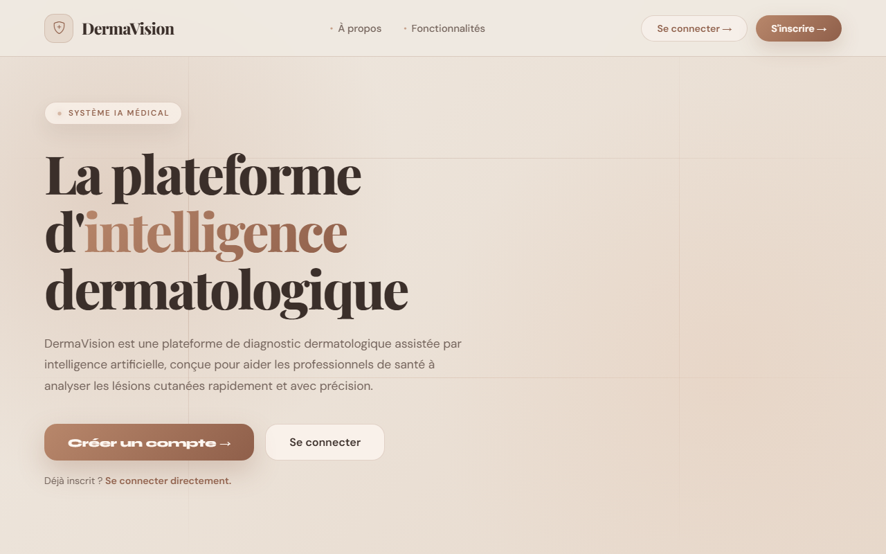 | 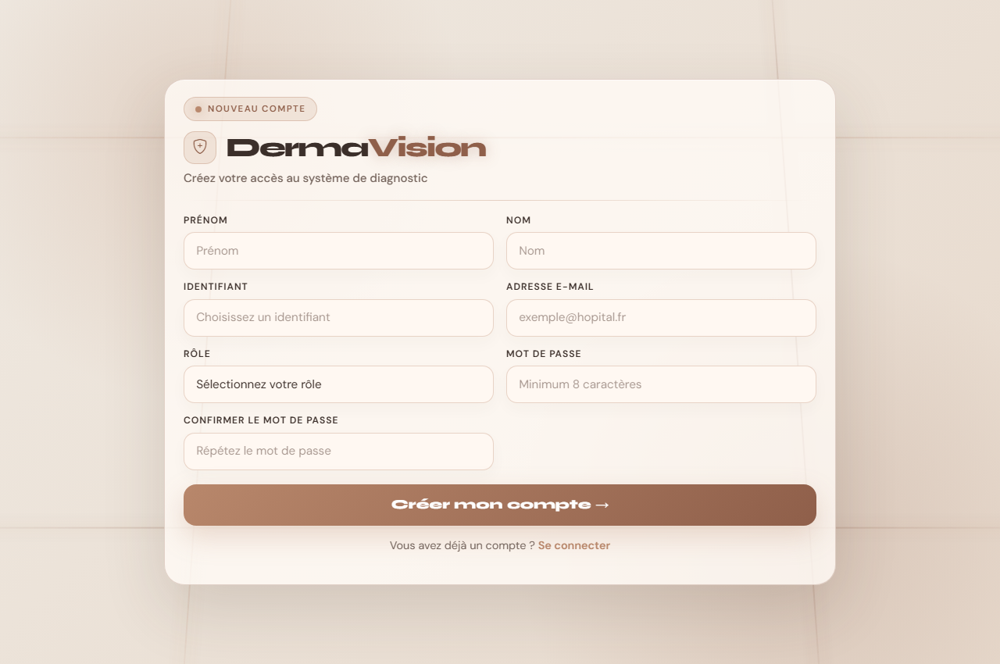 |  |

| Analyse IA | Résultat | Liste des patients |
|:---:|:---:|:---:|
| 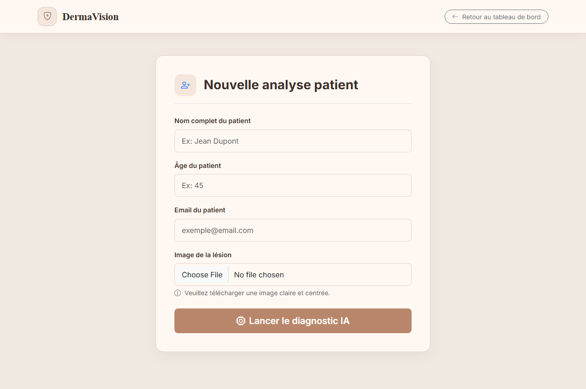 |  | 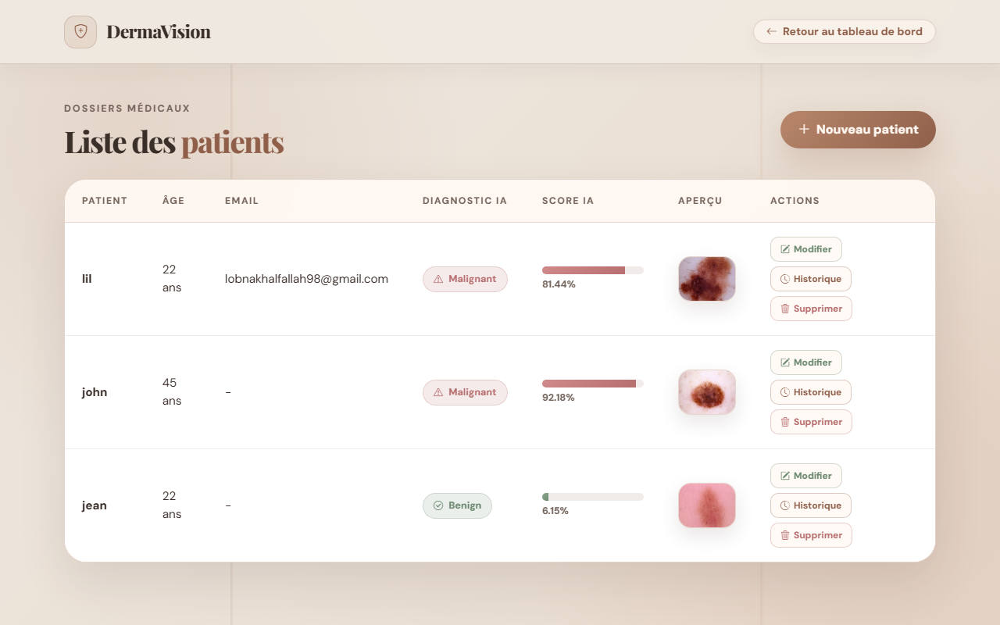 |

| Historique | Statistiques | Assistant IA |
|:---:|:---:|:---:|
| 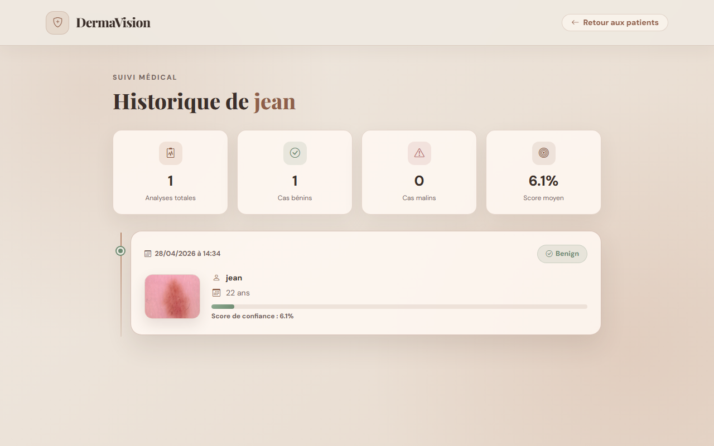 | 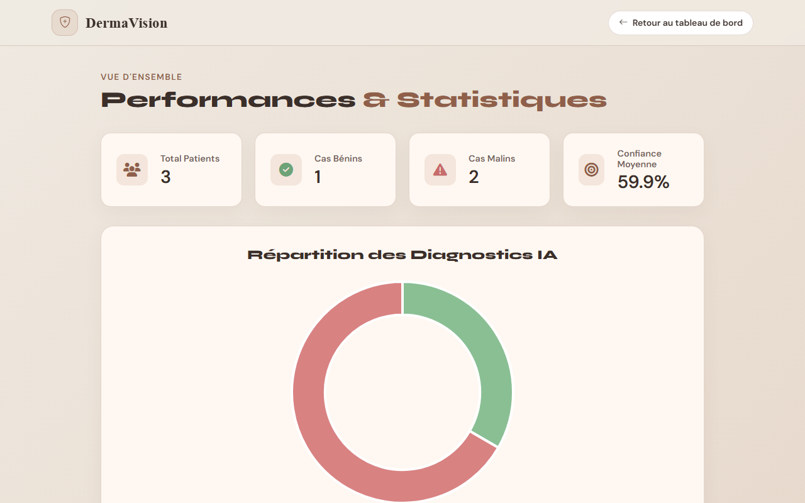 | 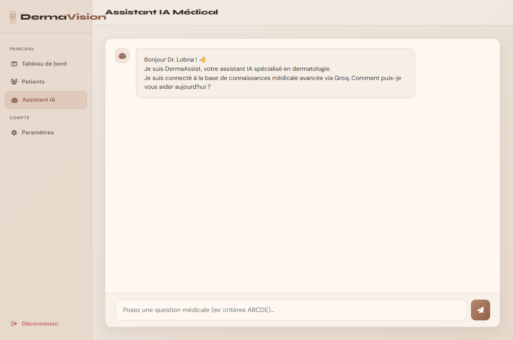 |

| Paramètres | FAQ & Aide |
|:---:|:---:|
| 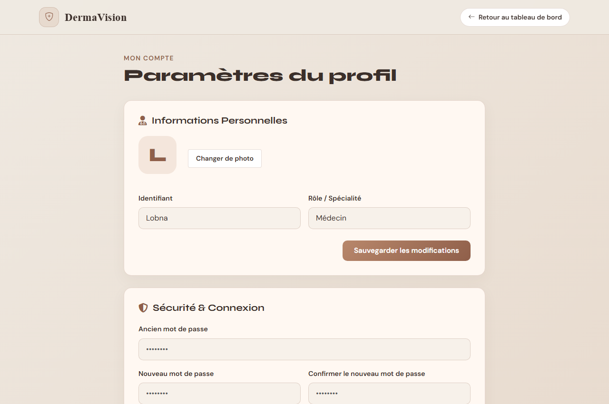 | 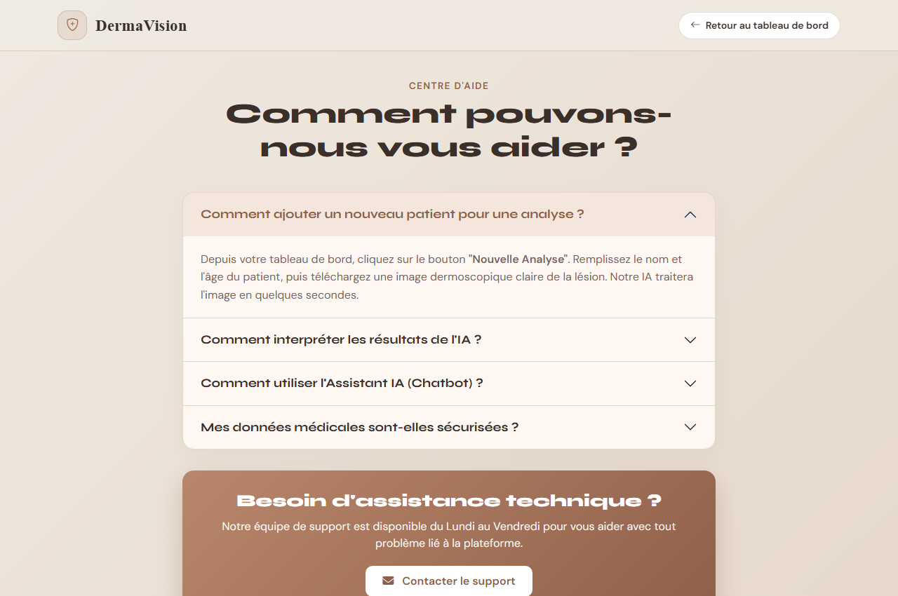 |

---

## Points forts

- Interface web moderne avec glassmorphisme, gradients et micro-animations
- Modèle VGG16 hautement performant pour la classification dermoscopique
- Assistant médical IA conversationnel avec accès aux données patients
- Notifications email automatiques pour les cas à risque
- Gestion complète du cycle de vie du patient (CRUD + historique)
- Architecture Flask légère et déployable facilement

---

## Améliorations futures

- [ ] Intégration d'un système d'authentification avec hachage des mots de passe (Werkzeug)
- [ ] Export PDF des rapports d'analyse
- [ ] Support multi-langues (arabe, anglais)
- [ ] Déploiement sur un serveur cloud (Heroku, Railway, etc.)
- [ ] Application mobile (React Native ou Flutter)
- [ ] Intégration de davantage de classes de lésions cutanées

---

## Avertissement médical

> **DermaVision est un outil d'aide au diagnostic et ne remplace en aucun cas l'avis d'un dermatologue qualifié.**
> Les résultats fournis par l'IA doivent toujours être confirmés par un examen clinique professionnel.

---

## Auteurs

| Rôle | Nom |
|---|---|
| **Développeur** | LOBNA Khalfallah |
| **Encadrante** | Amira Chtioui |

---

## Licence

Ce projet est réalisé dans le cadre d'un Projet de Fin d'Année (PFA) à titre académique.
Toute reproduction ou utilisation commerciale est soumise à autorisation préalable.

Voir le fichier [LICENSE](LICENSE) pour plus de détails.